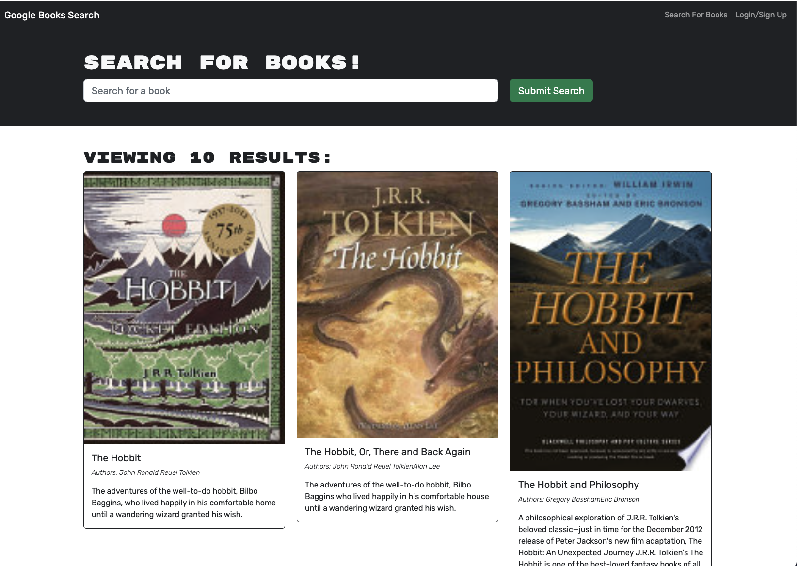

# Book_Search

## Description
This website acts as a search engine for books and upon a user's search renders a list of books that the user, once signed in, can save to their saved books list. The front-end of this website was created using React and the backend was created using MongoDB, GraphQL, and ApolloServer to create a full MERN stack.

## Site Image

## Deployed Site
[https://meyertalon.github.io/Portfolio/]